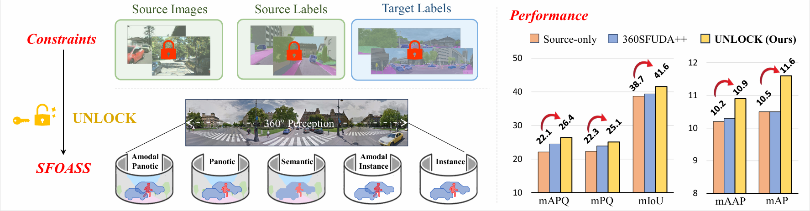

# UNLOCK
[ICCV2025] Unlocking Constraints: Source-Free Occlusion-Aware Seamless Segmentation

[arXiv: 2506.21198](https://arxiv.org/pdf/2506.21198)

code is coming soon

## Abstract
Panoramic image processing is essential for omni-context perception, yet faces constraints like distortions, perspective occlusions, and limited annotations. Previous unsupervised domain adaptation methods transfer knowledge from labeled pinhole data to unlabeled panoramic images, but they require access to source pinhole data. To address these, we introduce a more practical task, _ie_, Source-Free Occlusion-Aware Seamless Segmentation (SFOASS), and propose its first solution, called **UNconstrained Learning Omni-Context Knowledge (UNLOCK)**. Specifically, UNLOCK includes two key modules: Omni Pseudo-Labeling Learning and Amodal-Driven Context Learning. While adapting without relying on source data or target labels, this framework enhances models to achieve segmentation with 360° viewpoint coverage and occlusion-aware reasoning. Furthermore, we benchmark the proposed SFOASS task through both real-to-real and synthetic-to-real adaptation settings. Experimental results show that our source-free method achieves performance comparable to source-dependent methods, yielding state-of-the-art scores of 10.9 in mAAP and 11.6 in mAP, along with an absolute improvement of +4.3 in mAPQ over the source-only method.

<p align="center">
  
<br>
<em>UNLOCK framework solves the Source-Free Occlusion-Aware Seamless Segmentation (SFOASS), enabling segmentation with 360° viewpoint coverage and occlusion-aware reasoning while adapting without requiring source data and target labels</em>
</p>

## Contact
If you have any suggestions or find our work helpful, feel free to contact us

Email: caoyihong97@foxmail.com

If you find our work useful, please consider citing it:

```
@inproceedings{cao2025unlock,
  title={Unlocking Constraints: Source-Free Occlusion-Aware Seamless Segmentation},
  author={Yihong Cao and Jiaming Zhang and Xu Zheng and Hao Shi and Kunyu Peng and Hang Liu and Kailun Yang and Hui Zhang},
  booktitle={Proceedings of the IEEE/CVF International Conference on Computer Vision (ICCV)},
  year={2025}
}
```
